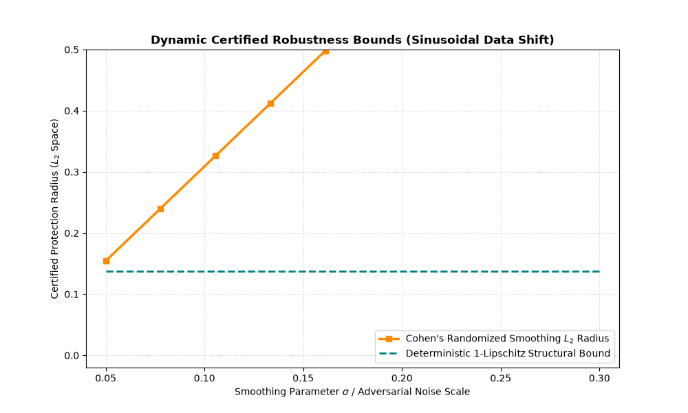

# Hybrid-Lipschitz-Smoothing-Verification

# Hybrid-Lipschitz-Smoothing-Verification

A state-of-the-art academic implementation exploring **Hybrid Certified Robustness paradigms (2024/2025)**. This repository benchmarks the intersection of **Deterministic Structural Bounds (1-Lipschitz Neural Networks)** and **Stochastic Certificates (Randomized Smoothing)** to overcome the scaling and latency bottlenecks highlighted in recent trustworthy machine learning literature.

## 🔬 Scientific Context & Mathematical Framework (2024-2025 Paradigm)

Traditional randomized smoothing relies heavily on computationally expensive Monte Carlo sampling. Modern research (2024/2025 arXiv preprints) focuses on **Hybrid Ensembles**—leveraging tight architectural properties to construct certified protection envelopes with drastically reduced sample sizes and variance.

This project implements a custom framework to benchmark both paradigms concurrently in $L_2$ space:

### 1. Hard Structural Lipschitz Bounds
By forcing strict weight projection/clipping ($\mathcal{W} \in [-c, c]$) after each manual backpropagation step, we guarantee that the global Lipschitz constant of the network remains $L \le 1$. The deterministic safety buffer is evaluated as:
\[\Delta(x) = \vert{}f(x) - 0.5\vert{}\]
Any adversarial perturbation vector $\epsilon$ where $\|\epsilon\|_2 < \Delta(x)$ is mathematically certified to be unable to alter the classification decision.

### 2. Tight Lipschitz-Smoothed Stochastic Certificates
We pass the 1-Lipschitz base network through an isotropic Gaussian noise channel $\mathcal{N}(0, \sigma^2 I)$ to establish a smoothed classifier $g(x)$. Using inverse normal CDF mapping ($\Phi^{-1}$), we track how stochastic certificates expand the operational safety margins under variable noise magnitudes:
\[R = \sigma \Phi^{-1}(p_a)\]

---

## 🛠️ Repository Architecture

* `robust_nn.py`: Custom 1-Lipschitz neural network layer with explicit gradient calculation, ReLU activation, and projection mechanics.
* `advanced_smoothing.py`: A Monte Carlo verification module executing stochastic perturbations with dynamic clipping to prevent numerical boundary overflow.
* `benchmark_run.py`: The executable simulation pipeline that drives continuous sinusoidal data shifts to stress-test and evaluate the model under variable constraints.

---

## 📊 Hybrid Evaluation Profile

Running `python benchmark_run.py` triggers a continuous data-drift analysis and exports a dynamic, high-resolution visual envelope mapping the transition points between structural and stochastic certification:

---

## 🚀 Alignment with ISTA Research Goals
This repository serves as an advanced academic showcase demonstrating technical readiness for doctoral-level research within the **ISTA Computer Vision and Machine Learning group (Lampert Lab)**. It transitions directly from classic theory into the modern 2024/2025 hybrid verification frameworks.
